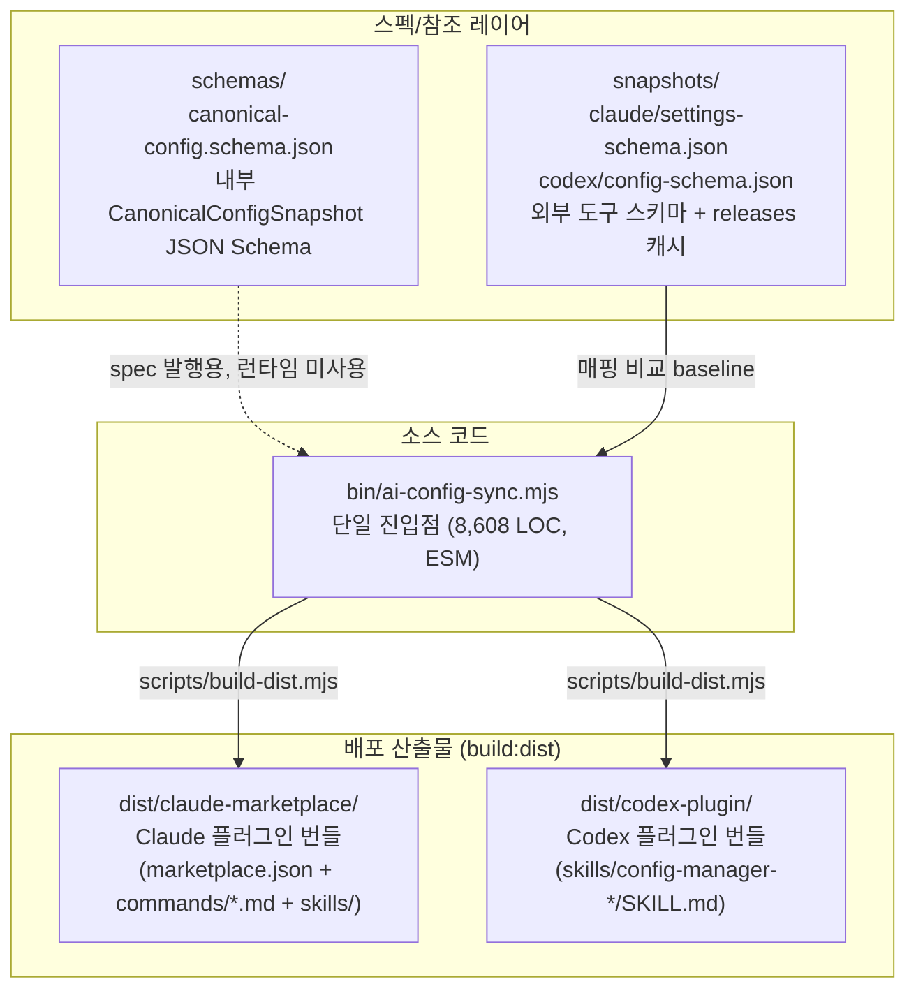

# Workflow

> 현재 단계: **실행/검증 단계** (publish 전). plugin/CLI 동작 자체를 두 host에서 직접 install·실행해 검증한다. npm publish, scoped name 확정, 자동 PATH version 가드 활성화 등은 후속.
> 배포 설계 전체는 [`.claude/docs/distribution-workflow.md`](./distribution-workflow.md) 참고.
> 설치/실행 흐름도(로컬 ↔ 프로덕션 매핑, 처음 설치부터 명령 실행까지)는 [`.claude/docs/install-flow.md`](./install-flow.md).

---

## 0. 전체 데이터 흐름



> `bin/ai-config-sync.mjs` 단일 파일이 정식 진입점이다 (옵션 B 채택, 모노레포 미도입). `schemas/`는 외부에 발행하는 스펙 문서이고 AJV 등 런타임 검증기는 도입돼 있지 않다 (구문별 try/catch만 동작). 점선은 현재 미연결 경로.

---

## 1. 설치 (두 진입 방향 모두 지원)

### 방향 1 · Claude marketplace 먼저
```text
/plugin install ai-config-sync-manager@...
/config-manager:connect
```
첫 호출 시 launcher가 PATH 또는 `AI_CONFIG_SYNC_ROOT`로 본체를 찾아 호출. connect가 Codex 쪽에도 plugin shim을 자동 등록한다.

### 방향 2 · Codex plugin 먼저
```text
Codex plugin install (local marketplace 또는 OSS publish 후)
config-manager-connect
```
connect가 Claude 쪽에도 plugin shim을 자동 등록한다.

### Dev/Local
이 레포에서 직접 작업할 때:
```bash
export AI_CONFIG_SYNC_ROOT=$(pwd)
node bin/ai-config-sync.mjs status
```

---

## 2. 명령 흐름

### Connect
```text
1. 현재 host 감지.
2. Claude/Codex 설치 상태 확인.
3. 누락된 host integration을 자동 등록 (filesystem write 가능 시).
4. 차단된 경우 수동 install 절차를 정확한 명령으로 출력.
5. 설치 후 status 검증을 다시 실행.
```

설치 시 plugin target은 managed directory로 취급:
- target path가 expected pattern인지 검증 (`~/.claude/plugins/config-manager@ai-config-sync-manager`, `~/plugins/ai-config-sync-manager`).
- 검증 통과 시 기존 디렉터리를 깨끗이 제거 후 shim 재설치 (stale 파일 잔존 방지).

### Status
`/config-manager:status` → 번들된 `ai-config-sync status` 호출 → risk-classified diff 출력.

기본은 global + project 모두 검사. `--scope global` / `--scope project`로 좁힐 수 있다.

`status-ignore.json`(`exclude: [{area, term}]`)이 있으면 사용자가 의도적으로 무시하기로 한 라인은 diff에서 마스킹된다.

### Sync
`/config-manager:sync` → 기본 `sync --dry-run`. apply 모드는 backup 생성 + `--confirm` yes-gate 필수. manual 표시 항목은 dry-run에 노출되며, MVP에서 `sync --apply`는 plan된 writable 항목을 일괄 적용하되 위험한 permission은 review note + patch preview 후 작성한다.

전체 매핑 흐름: [`.claude/docs/maximal-one-to-one-mapping.md`](./maximal-one-to-one-mapping.md)

### Paraphrase
`paraphrase --apply --map "Skill=verification routine"` 형태로 호출.
- 매칭된 라인의 토큰을 직접 rewrite하고 `paraphrase-overrides.json`에 매칭 좌표(`claude_path`/`codex_path`/`*_line`)를 등록.
- `paraphrase-map.json`은 토큰 사전 (`claude_only` / `codex_only`)으로, override가 없는 항목도 dictionary library로 보관.
- 두 파일 분리 의도: **map = lookup library, override = matched-line registry**.

---

## 3. 배포 워크플로우 (요약)

설계 결정: **글로벌 npm install + thin launcher plugin** (안 C). 본체는 npm registry 단일 패키지, plugin은 launcher만 들고 있다. 두 진입 방향 모두 지원.

Launcher resolution order:
```text
1. AI_CONFIG_SYNC_ROOT 환경변수 (dev override)
2. PATH의 ai-config-sync (npm install -g 케이스, recursion 방지 + version 비교)
3. npm exec --yes --package=ai-config-sync-manager@<pinned> -- ai-config-sync (네트워크 fallback)
4. 안내 메시지 후 exit 1
```

Drift 가드: version pin 자동 주입 / PATH binary 일치 검사 / state `schemaVersion` / `--version` self-check.

상세: [`.claude/docs/distribution-workflow.md`](./distribution-workflow.md)

---

## 5. 현재 상태

- `connect`: install 상태 감지, 누락된 local Claude·Codex integration 등록 (write 가능 시), 차단 시 수동 절차 안내, `connect --help` 지원.
- `status`: global/project scope, 기본/grouped 출력, `--compact`, `--tree`, 항목별 매핑 품질 라벨, `--include`/`--exclude` selector. status-ignore 룰 반영.
- `sync`: dry-run/apply, `--confirm`, `--plan-json`, command help, 항목별 매핑 품질 라벨, backup, selector, skill missing-copy, permission item merge, hook item merge, MCP server merge, Bash/MCP/hook 대상 Codex native 매핑, baseline 기반 기본 방향 결정.
- `paraphrase`: `--apply` / `--register` / `--map` 인자, line-level override archive, override + map 두 파일 분리 책임. `--non-interactive` flag로 자동화 가능.
- `permissions`: Claude→Codex native 매핑 (Bash prefix, MCP tool approval, workspace-write sandbox hint). exact Bash/MCP 매핑은 더 이상 중복 managed comment를 남기지 않음.
- `permissions reverse`: Codex `prefix_rule()`과 MCP tool approval을 가역 가능한 범위에서 Claude permission bucket으로 역변환.
- `hooks`: command hook이 Claude settings ↔ Codex native hook TOML 양방향 변환. unsupported handler는 managed metadata로 잔존.
- `mcp`: 서버 단위 merge + `mcp:notion` / `mcp:playwright` 같은 selector. 서버별 patch preview, secret 패턴 env는 metadata-only로 skip.
- `skills`: 누락 skill 디렉터리 복사. 동일 이름 content drift는 manual conflict. delete/overwrite는 MVP 외.
- `agents`: AGENTS/CLAUDE 지시문 비교. standalone agent 파일 동기화는 Codex agent schema 확정 전까지 MVP 외.
- `commands`: slash command 변환은 partial/manual-review 전용, 자동 write 안 함.
- `tests/unit`: selector 파싱, Bash prefix 변환, MCP tool approval 변환, MCP server merge, hook 변환, baseline 기반 기본 sync 방향, backup/apply 동작에 대한 repo 소유 `node:test` fixture (228+ tests).
- `tests/integration/manual-codex-to-claude`: 9 case × 13 column harness. ECC 실레포 mapping fixture, paraphrase override + map split, status-ignore, post-sync setup.sh 훅까지 자동 검증.
- `package check`: npm lockfile 셋업으로 repo-local `npm run check` 통과.
- `lint/format`: ESLint flat config + Prettier 셋업 완료 (configs only, 기존 소스 미변경).
- `dist`: 로컬 Claude marketplace + Codex plugin dist build 성공.

---

## 6. 실행 순서

```text
변경 → npm run check → npm test → npm run build:dist → manual harness (필요 시) → 커밋.
```

각 milestone은 §8.5 검증 절차 통과를 전제로 한다.

---

## 8. 남은 핵심 작업

### 8.1 Distribution C안 — 실행 단계 (완료)

`.claude/docs/distribution-workflow.md` §8 구현 변경 포인트 중 publish-independent한 항목.

- [x] `scripts/build-dist.mjs`: integrations만 plugin에 복사 (`bin`/`packages`/`schemas`/`rules` 미포함).
- [x] launcher 템플릿을 `scripts/lib/host-launcher.mjs`로 분리 (build-dist + connect 양쪽이 공유).
- [x] launcher 새 resolution order 적용 (AI_CONFIG_SYNC_ROOT → PATH → npm exec → fail). PATH 발견 시 realpath 비교로 자기-자신 recursion 방지.
- [x] `bin/ai-config-sync.mjs`의 `copyPluginRoot` 축소 — `installClaudePlugin` / `installCodexPlugin`이 `ensureManagedPluginTarget`으로 expected pattern 검증 후 `rmSync` → `copyPluginRoot` → launcher 작성.
- [x] hardcoded `version: "0.1.0"` 자동 주입 — `runtimeVersion` 변수가 `installed_plugins.json` / Codex `marketplace.json` / Claude marketplace 모두에 주입.
- [x] `integrations/{claude,codex}-plugin/skills/**/SKILL.md`의 고정 cache path 제거 → launcher 호출 형태로 통일.
- [x] `package.json`의 `bin` entry를 `./bin/ai-config-sync.mjs`로 변경. dev wrapper는 `scripts/dev-launcher`로 이동.
- [x] state `schemaVersion: 1` 도입 (`STATE_SCHEMA_VERSION`). missing 시 backfill 경고, mismatch 시 abort + 안내 메시지.
- [x] `tests/cli-fixtures.test.mjs` 보강: thin dist 산출물, host-launcher resolution 분기, connect stale cleanup, version injection 시나리오 커버.

### 8.2 모노레포 전환 — 옵션 B (단일 진실원 못박기) 적용 완료

레퍼런스 검토 결과 (semantic-release #4072 미실행 / oclif Core 통합 / symflow·Turborepo retrospective 회귀 / pkgpulse·dbashkatov 가이드 "단일 앱은 monorepo 오버헤드만") + 현재 상황 (개발자 1명, 외부 contributor 0, 사실상 단일 패키지, 8,608 LOC, publish 전)을 종합해 **옵션 B 채택**. `packages/{cli,core}`는 어떤 코드도 import하지 않는 dead scaffold로 확인됨 (정적 grep + `mv packages /tmp/...` 격리 후 `npm test 259/259 pass` + `npm run build:dist` 정상 + CLI 명령 모두 정상 동작). `bin/ai-config-sync.mjs`가 동일 이름의 함수를 자체 구현으로 보유.

- [x] `packages/cli` / `packages/core` 디렉터리 제거 (dead scaffold, 어디서도 import 안 됨).
- [x] `package.json`에서 `workspaces` 필드 + `build` / `check` script 삭제.
- [x] `bin/ai-config-sync.mjs`를 정식 단일 진입점으로 확정 (코드 변경 없음).
- [x] `tsconfig.json` / `tsconfig.check.json` 삭제 (packages 외에 type-check 대상이 없어 의미 손실 없음. 후속에서 mjs type-check가 필요해지면 §8.4 별도 task로 도입).
- [x] mermaid 다이어그램 §0 갱신: SRC 서브그래프를 `BIN` 단일 노드로 정리. 점선 `CLI -.-> BIN` 제거, 점선 `SCH -.-> BIN` 유지.
- [x] `npm test` 259/259 pass + `npm run build:dist` 정상 빌드 확인.

**재검토 트리거 (옵션 A로 회귀 조건)**
- `bin/ai-config-sync.mjs` LOC가 5,000+ 도달 (현재 8,608이므로 *이미 도달했지만 단일 maintainer + publish 전이라 분리 이익 < 비용*. 외부 contributor 신호와 함께 종합 판단).
- `core` 로직을 별도 npm 패키지로 publish하려는 외부 요청 발생.
- 외부 contributor가 모듈 단위 PR을 보내기 시작 (모듈 경계가 외부에 가시화되는 시점).

### 8.3 Publish 단계 (실행 단계 + 모노레포 결정 후)

- [ ] **npm 패키지 이름 확정**: `ai-config-sync-manager` 그대로 vs `@ai-config-sync-manager/cli` (scoped). 결정 시 launcher pin / installed key / marketplace name까지 동시 변경.
- [ ] `package.json`의 `files` 필드 추가 — `bin`, `packages`, `schemas`, `rules`, `README.md`, `LICENSE`만 포함.
- [ ] `publishConfig` 검토 (scoped 채택 시 `access: "public"`).
- [ ] `npm publish` dry-run으로 artifact 점검.
- [ ] launcher의 `npm exec` fallback 활성화 검증 (사용자가 npm install 안 한 상태).
- [ ] PATH version 차이 정책 확정 — 기본안: patch 무시 / minor 경고 / major abort.
- [ ] README의 install 안내 (방향 1, 2 둘 다 + first-run의 npm exec가 원격 코드 fetch라는 명시).
- [ ] GitHub repo remote + Claude marketplace 등록 + Codex plugin local/OSS install 흐름 문서화.

### 8.4 후속 (별도 작업 단위)

- [ ] **Skill symlink 지원**: 현재 symlink skill은 `unsupported` status-only로 노출하고 sync에서는 제외. 후속에서 link 자체 보존 vs target content materialize 정책을 확정.
- [ ] **Cursor/Windsurf 등 추가 host 동기화 지원**: launcher 패턴은 동일 적용 가능. 각 host의 plugin/extension spec과 설정 저장소를 조사 후 `integrations/<host>-plugin/` 신설.
- [ ] **Memory / context sync 검토**: 현재는 `memory`, implicit context, agent runtime state를 Deferred로 유지. 후속 RFC에서 저장소 위치·스키마·redaction·conflict policy를 먼저 확정하고, 1단계는 read-only discovery/status만 지원한다. apply는 명시적 opt-in selector(`--include memories:<name>` 등)와 백업/preview 정책이 준비된 뒤 별도 구현.
- [ ] **`rules/*.json` 의 실제 import**: 현재 mapping rule이 mjs에 인라인. `permissions-map.json` / `bash-prefix-map.json` / `mcp-map.json` / `hooks-map.json`로 데이터화 (`.claude/docs/maximal-one-to-one-mapping.md:114-146` 제안).
- [ ] **TOML 파서 교체**: 현재 정규식 mini-editor. inline env 객체 등 가정이 깨지는 케이스 도래 전 `@iarna/toml` 또는 자체 구조체 기반 에디터로 교체.
- [ ] **CI 도입**: GitHub Actions 1개로 `npm run check` + `npm test` + `npm run build:dist` + `npm run lint` + `npm run format:check`.
- [ ] **schemas 런타임 검증**: 사용자 편집 가능한 `paraphrase-overrides.json` / `paraphrase-map.json` / `status-ignore.json` 손상 시 친절한 에러 메시지가 필요하면 AJV 도입 검토. 현재는 try/catch + 수동 가드로 충분.
- [ ] **mjs type-check 도입 검토**: 옵션 B로 packages 제거 시 `tsconfig.check.json`도 함께 삭제했음. mjs 자체에 `// @ts-check` + JSDoc 또는 `tsconfig` (allowJs/checkJs) 설정으로 type-check를 다시 도입할지 여부는 별도 task. 현재는 `node:test` runtime 검증으로 충분.
- [ ] **backups / status-details retention**: 현재 `${home}/.ai-config-sync-manager/backups/` (apply당 1 dir) / `status-details/` (status당 1 file) 모두 prune 로직 없음. 비슷한 도구 관행 (kubectl rollout 10 / Time Machine 30일 / logrotate 7-30일) 기반으로 **backups 30개 / status-details 100개** FIFO retention 도입. `sync --apply` 시작 시점에 oldest부터 정리하는 한 줄 추가 (minimal diff).

### 8.5 Milestone 검증 절차

각 milestone 완료 후:
1. `npm run check` + `npm test`.
2. `npm run build:dist`.
3. `tests/integration/manual-codex-to-claude/scripts/run-cases.sh` (9 cases × 13 columns 모두 0).
4. Claude plugin install/update.
5. Codex command 실행 + Claude command 실행.
6. 두 host가 동일한 `status`를 보고하는지 확인.
